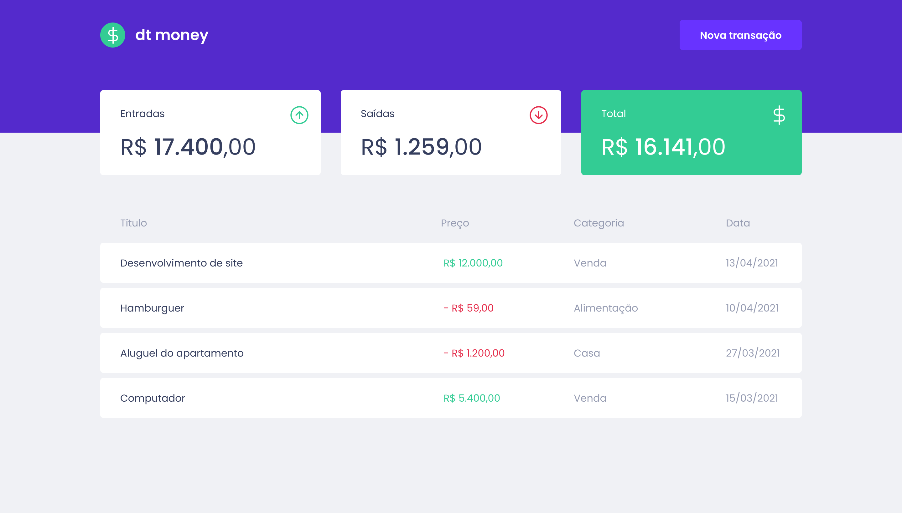

# DTMONEY-REACTJS
Frontend construído em ReactJs com typescript da aplicação dtmoney.




## Rodando a aplicação
1. Antes de rodar a aplicação é necessário ter instalado:

* nodeJS
* yarn

2. Instale as dependências executando o comando abaixo no diretório raiz para gerar a pasta *node_modules*:
```
$ yarn install
```

3. Execute o comando para iniciar o servidor web embutido:
```
$ yarn start
```

4. Acesse no navegador o endereço web:
```
http://localhost:3000
```

## Autor
Lucas Costa – [Linkedin](https://www.linkedin.com/in/lucashcruzcosta/)